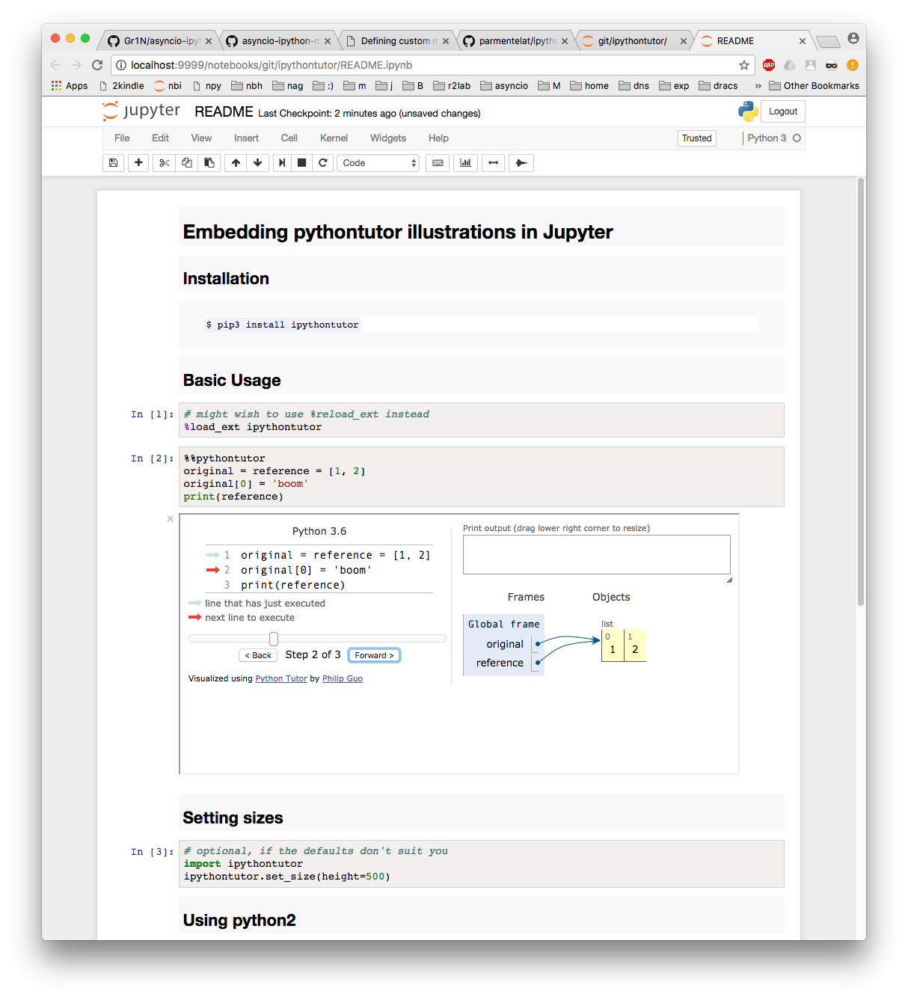

<span style="float:left;">Licence CC BY-NC-ND</span>

# Embedding pythontutor illustrations in Jupyter  

## Installation

```
$ pip3 install ipythontutor
```

## Screeshot

As github won't render iframes embedded in a `ipynb`, here's a screenshot



## Basic Usage


```python
# required to load the extension
%load_ext ipythontutor
```

In its simplest form, the code in the cell is handed over (as python3) to the excellent http://pythontutor.com/


```python
%%ipythontutor
original = reference = [1, 2]
original[0] = 'boom'
print(reference)
```

## Setting sizes


```python
# optional, if the defaults don't suit you
import ipythontutor
ipythontutor.set_size(height=500)
```

## Using python2


```python
%%pythontutor2
print "Hey"
original = [1, 2]
copy = original[:]
original[0] = 'boom'
```
