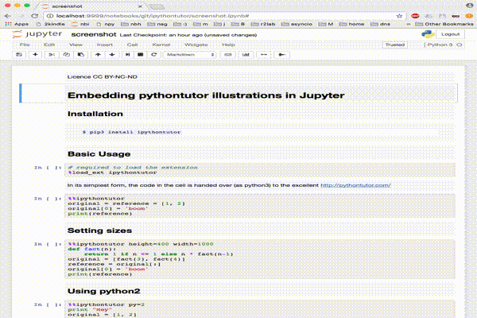

---
jupytext:
  cell_metadata_filter: all,-hidden,-heading_collapsed
  formats: md:myst
  notebook_metadata_filter: all,-language_info,-toc,-jupytext.text_representation.jupytext_version,-jupytext.text_representation.format_version
  text_representation:
    extension: .md
    format_name: myst
kernelspec:
  display_name: Python 3
  language: python
  name: python3
---

Licence CC BY-NC-ND - Thierry Parmentelat

+++

# Embedding `pythontutor.com` illustrations in Jupyter  

this notebook is stored in text (markdown) format using jupytext,
make sure to have this tool installed if you want to open it locally

+++

## Installation

```
$ pip3 install ipythontutor
```

+++

## Screeshot

As github won't render iframes embedded in a `ipynb`, here's a screenshot



+++

## Basic Usage

```{code-cell} ipython3
# required to load the extension
%load_ext ipythontutor
```

In its simplest form, the code in the cell is handed over (as python3) to the excellent http://pythontutor.com/

```{code-cell} ipython3
%%ipythontutor
original = reference = [1, 2]
original[0] = 'boom'
print(reference)
```

## Setting sizes

```{code-cell} ipython3
%%ipythontutor height=400 width=850
def fact(n):
    return 1 if n <= 1 else n * fact(n-1)
original = [fact(3), fact(4)]
reference = original[:]
original[0] = 'boom'
print(reference)
```

## Scaling

If your page is smaller than what pythontutor can reasonably work with, you can specify a scaling ratio.

```{code-cell} ipython3
%%ipythontutor width=600 height=200 ratio=0.7
import copy
original = [1, [2, 3]]
reference = copy.deepcopy(original)
original[1][0] = 'boom'
print(reference)
```

## Add a button to open pythontutor in a new tab

```{code-cell} ipython3
%%ipythontutor linkButton=true
def fact(n):
    return 1 if n <= 1 else n * fact(n-1)
original = [fact(3), fact(4)]
reference = original[:]
original[0] = 'boom'
print(reference)
```

## Other settings

The following list shows the settings that can be tweaked on the magic line. See also [this page about embedding pythontutor](http://pythontutor.com/pytutor-embed-demo.html) for more details on these settings:

```{code-cell} ipython3
from ipythontutor import Magics
for var, default in Magics.defaults.items():
    print(f"{var:>20} - defaults to - {default:<}")
```

#### Note on `proto`

The default is to use `https` to reach `pythontutor`, as this is exepcted to work in most cases. If that's not working for you, instead of setting `proto=http` on each magic cell, you can change this globally - like any other default btw - this way:

```{code-cell} ipython3
from ipythontutor import Magics
Magics.defaults['proto'] = 'http'
```

## Using python2

```{code-cell} ipython3
%%ipythontutor py=2
print "Hey"
original = [1, 2]
copy = original[:]
original[0] = 'boom'
```

## See also

Check out another pure approach, that does not rely on pythontutor, [at the `nbtutor` project](https://github.com/lgpage/nbtutor).
